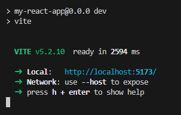

# Creating A React App

First off, I'm going to assume you have NPM and Node installed. 

Depending on your Operating System:

1. OSX or Linux

    1. run the following from your terminal `curl -o- https://raw.githubusercontent.com/nvm-sh/nvm/v0.39.7/install.sh | bash`
    2. run `command -v nvm`
    
        Note: On Linux, after running the install script, if you get nvm: command not found or see no feedback from your terminal after you type command -v nvm, simply close your current terminal, open a new terminal, and try verifying again.

    3. run `nvm install --lts` to install node

2. Windows

    Follow [this guide](https://learn.microsoft.com/en-us/windows/dev-environment/javascript/nodejs-on-windows#install-nvm-windows-nodejs-and-npm) to install.

## Install Vite

First, we're going to install [Vite](https://vitejs.dev/). Vite is a build tool that provides and instant server and uses modern JavaScript features like ES modules.

> All over the web, you'll see examples of scaffolding or creating a React app using `create-react-app`. In 2023, the Create React App tool was deprecated, which means that it was no longer being maintained. Create React App has been the go-to way to make a new React project, but it's been dethroned by a number of different alternatives, like Vite and Next.js.

Run the following from the terminal:

`npm install -g vite`

## Create Our App

Now we are going to use Vite to create our basic react app. We're going to unimaginatively call our app `my-react-app` like all good guides.

When we run this in the terminal, it will create a folder called `my-react-app` will the skeleton react code in it.

Run the following command to create your app, and follow any prompts:

`npm create vite@latest my-react-app -- --template react`

This command creates a new React project named "my-react-app" using the React template provided by Vite.

Now navigate to the project directory:

`cd my-react-app`

And install all the dependencies required by running:

`npm install`

### Running the app

Without doing anything else, you can now run you app by typing in `npm run dev` and opening your browser at THE LOCATION SPECIFIED:

> If you are using Chrome, sometimes it won't provide a secure connection to localhost. To overcome this, go to the following web address in Chrome: `chrome://net-internals/#hsts`
>
> In the section **Delete domain security policies**, in the Domain textbox, enter `localhost` and click delete. Now try opening the link again.

### Stopping the app

In the terminal where you executed `npm run dev`, use `Ctrl+C` to stop the app.

## Open in VS Code

You can open your react app in VS Code a couple of ways, but the easiest for right now is on the terminal - assuming you haven't moved directories and are still in the `my-react-app` folder - enter `code .` to open VS Code showing all the app code.

---

Okay, now we can look at our code, let's [explore our app >>](chapter2.md)