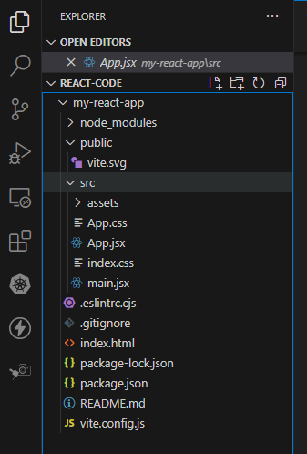
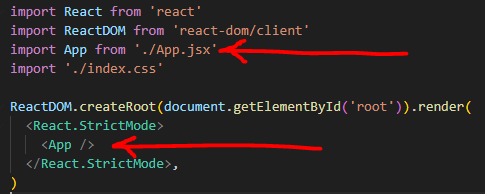

# Exploring our app

Now that we have a basic app skeleton, we can have a look at what the bones are. In VS Code, you can see the project structure:



So far we're not too scared.  There's an iindex.html file, so we guess that's thepage that is shown when we ran the app. Open it up and have a look at the code:

```html
<!doctype html>
<html lang="en">
  <head>
    <meta charset="UTF-8" />
    <link rel="icon" type="image/svg+xml" href="/vite.svg" />
    <meta name="viewport" content="width=device-width, initial-scale=1.0" />
    <title>Vite + React</title>
  </head>
  <body>
    <div id="root"></div>
    <script type="module" src="/src/main.jsx"></script>
  </body>
</html>
```

What you'll probably notice here is that the HTML doesn't fully match *what's actually shown when we run the app*:


So what's going on here? 

Well looking at our HTML, we can see there is a `script` tag which has a type of `module` and points to `/src/main.jsx`. This script tag imports the main JavaScript file of the React application:

```html
<script type="module" src="/src/main.jsx"></script>
```

Okay, so what's in the `main.jsx` file. Let's open it up and have a look.

## main.jsx

```js
import React from 'react'
import ReactDOM from 'react-dom/client'
import App from './App.jsx'
import './index.css'

ReactDOM.createRoot(document.getElementById('root')).render(
  <React.StrictMode>
    <App />
  </React.StrictMode>,
)
```

So what's all that doing? Let's break it down into two parts, importing dependencies and rendering to the screen.

1. Importing Dependencies
```js
import React from 'react';
import ReactDOM from 'react-dom/client';
import App from './App.jsx';
import './index.css';
```

`React` - imports the React library, which is necessary for defining and working with React components.

`ReactDOM` - imports the ReactDOM library, which is used for rendering React components into the DOM.

`App` - imports the main component of the application, typically located in a file named `App.jsx`.

`index.css` - imports a CSS file to style the application. 

2. Rendering the Application
```js
ReactDOM.createRoot(document.getElementById('root')).render(
  <React.StrictMode>
    <App />
  </React.StrictMode>,
);
```

`ReactDOM.createRoot` - creates a new root instance for rendering React components into the DOM. It takes a DOM element as an argument (we use vanilla JS here using `document.getElementById`), typically the root container element (`<div id="root"></div>`), which we can see exists in our `index.html` file.

`.render() ` - renders the provided JSX element into the root container. In this case, it's rendering the `<App />` component. 

Remember we *imported* the App component earlier from `/App.jsx`? Well, that's our *component" doing all the magic.

Let's take a look at it now.

## app.jsx

```js
import { useState } from 'react'
import reactLogo from './assets/react.svg'
import viteLogo from '/vite.svg'
import './App.css'

function App() {
  const [count, setCount] = useState(0)

  return (
    <>
      <div>
        <a href="https://vitejs.dev" target="_blank">
          
        </a>
        <a href="https://react.dev" target="_blank">
          
        </a>
      </div>
      <h1>Vite + React</h1>
      <div className="card">
        <button onClick={() => setCount((count) => count + 1)}>
          count is {count}
        </button>
        <p>
          Edit <code>src/App.jsx</code> and save to test HMR
        </p>
      </div>
      <p className="read-the-docs">
        Click on the Vite and React logos to learn more
      </p>
    </>
  )
}

export default App

```

Okay, this one's a bit more complicated. However, at the top we have various imports. Only the top one is really confusing, something about state? We'll come back to managing state later, but the other three are just importing pictures or CSS. Okay, simple so far.

Let's look at the next part, which is defining the App component:

```js
function App() {
```

This function defines the `App` component, which is a *functional component* responsible for rendering the content within it (a mix of HTML and JSX).

Just like any other function that *returns* a value, this function returns the HTML/JSX, using the `return` keyword.

Because `App` is actually a function, we can do all sorts of normal cody things in it - declaring variables, doing calculations, anything we'd normally do.

In fact, the next line:

```js
const [count, setCount] = useState(0);
```

Declares a *state variable* named `count` initialized to **0**. We'll come back to state, but we're just in a function!

Let's look at the rest of the code. First up we have our return statement, which wraps its contents in parenthesis:

```js
return (
    <>
        // all the code
    </>
);
```

What you may notice next is that inside the return, we have *empty tags** - `<>` and `</>` - at the beginning and end.

The `<>` and `</>` at the start and end of the return statement in the App component are examples of a feature called **Fragment** in React.

---

### Fragments

In React, a Fragment is a way to group multiple elements without adding an additional DOM element. It's a common pattern used when you need to return multiple elements from a component's render method, but you don't want to add an extra wrapper `<div>` or other element to contain them.

```jsx
return (
  <div>
    <p>Element 1</p>
    <p>Element 2</p>
  </div>
);
```

In the above code, a `<div>` element is used to contain the two `<p>` elements. However, if you ***don't*** want to add an extra `<div>` to the DOM, you can use a Fragment instead:

```jsx
return (
  <>
    <p>Element 1</p>
    <p>Element 2</p>
  </>
);
```

Here, `<>` and `</>` act as a shorthand for `<React.Fragment> `and `</React.Fragment>`, respectively and allow you to create a fragment without explicitly importing React.

---

Okay, back to our `app.jsx` code. Most of it is simple HTML, apart from this button element:

```js
<button onClick={() => setCount((count) => count + 1)}>
    count is {count}
</button>
```

This is an [event handler](https://www.w3schools.com/js/js_events.asp) attached to the button's `onClick` event. It's triggered when the button is clicked.

Excellent, so now we have an event we want to handle. What's all that stuff inside the `{}`?

1. `() =>`  This syntax defines an *arrow function*. When the button is clicked, this arrow function will be executed.
2. `setCount((count) => count + 1)` Inside the arrow function, `setCount` is called with a new value for the count state. `setCount` is a function that is used update the state in a React functional component. Here we are updating the state of th3 count variable by adding 1 to it.

And then finally we use the variable count inside our button tag, by enclosing it in curly braces `{}` to indicate that it's a JavaScript expression:

```js
count is {count}
```

---

### State Basics

In React, state is managed using the `useState` hook, which allows functional components to have *stateful* behavior. When you call `useState`, it returns an array with **two** elements: the current state value and a function to update that state value. 

**NOTE**
In React, it's usual to name your function the saem as your variable, with the `set` prefix:

```js
const [colour, setColour] = useState("red");
const [name, setName] = useState("Bill");
const [year, setYear] = useState("1999");
```

You can use the `set` function in your code to update the value:

```js
setColour("Green")
setName("Ted")
setYear("1988")
```

In our code above, `setCount` is the function returned by `useState` that allows you to update the value of the count state variable.

Here's a breakdown of how `setCount` works:

#### Usage

`setCount(newValue)`

Where `newValue` is the new value that you want to set the state to.


#### Functional Update
`setCount` can also accept a *function* as an argument, which receives the previous state value as its parameter and returns the new state value. This is useful when the new state value depends on the previous state. As an example:

```jsx
setCount((prevCount) => prevCount + 1);
```

Here, `prevCount` represents the *previous* value of count. The function then returns `prevCount + 1`, effectively incrementing the current value of `count` by 1.

#### Asynchronous Behavior
It's important to note that `setCount` *does not immediately update the state*. Instead, it schedules an update to the component's state. React then batches state updates and performs them asynchronously for performance reasons. As a result, you should not rely on the state being immediately updated after calling `setCount`!

---

Finally, we *export* the `App` component:

```js
export default App;
```

This line *exports* the `App` component as the default export of the module, allowing it to be *imported* and used in other parts of the application - we import it in our `main.jsx` file, remember?



We *render* the component using `<App />`.

### State Objects

You can also store *objects* in state, for example:

```js
const [car, setCar] = useState({
    brand: "Ford",
    model: "Escort",
    year: "1984",
    colour: "red"
});
```

And you can use it via dot notation in your return:

```js
return (
    <>
      <h1>My {car.brand}</h1>
      <p>
        It is a {car.colour} {car.model} from {car.year}.
      </p>
    </>
  )
```

### Updating State Objects

When state is updated, the *entire* state gets overwritten.

What if we only want to update the colour of our car?

If we only called `setCar({colour: "blue"})`, this would *remove* the brand, model, and year from our state.

Instead, we can use the JavaScript spread operator to help us.

```js
import { useState } from "react";
import ReactDOM from "react-dom/client";

function Car() {
  const [car, setCar] = useState({
    brand: "Ford",
    model: "Escort",
    year: "1984",
    colour: "red"
  });

  const updateColor = () => {
    setCar(previousState => {
      return { ...previousState, colour: "blue" }
    });
  }

  return (
    <>
      <h1>My {car.brand}</h1>
      <p>
        It is a {car.color} {car.model} from {car.year}.
      </p>
      <button
        type="button"
        onClick={updateColor}
      >Blue</button>
    </>
  )
}

export default Car
```

Because we need the current value of state, we pass a function into our `setCar` function. This function receives the previous value.

We then return an object, spreading the `previousState` and overwriting only the colour.

---

Okay, we've explored our app and had a look at state. Next we'll look at [components >>](chapter3.md)