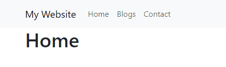

# Routing

At the moment, we have a single page, which doesn't make it the most exciting application. Now, we can use simple HTML links to pages, but it's a bit cumbersome.

Routing offers a few benefits including loading dynamic content, seamless navigation, and of course our state management!

When a user visits your website or interacts with it, they might want to go to different pages or views to access different content or features. Routing allows you to define rules or paths that map to specific pages or views in your application. When a user clicks on a link, submits a form, or performs any action that triggers a route change, the routing system determines which page or view to display based on the requested URL.

## Routing in Vite

Vite itself does not provide built-in routing capabilities like Next.js. However, you can easily set up routing in a Vite project by integrating it with a routing library such as React Router.

Install the react router package:

`npm install -D react-router-dom`

## Folder Structure

To create an application with multiple page routes, let's first start with the file structure.

Within the src folder, we'll create a folder named pages with several files, each of which contains a very basic React component:

>
>src\pages\:
>
> - Layout.jsx
> - Home.jsx
> - Blogs.jsx
> - Contact.jsx
> - NoPage.jsx

## Layout

We're going to use bootstrap for layout, as I like it. Install it using:

 `npm install bootstrap`.

### App.jsx

Now we need to update our `App.jsx` file:

```js
import 'bootstrap/dist/css/bootstrap.min.css';
import { BrowserRouter, Routes, Route } from "react-router-dom";
import Layout from "./pages/Layout";
import Home from "./pages/Home";
import Blogs from "./pages/Blogs";
import Contact from "./pages/Contact";
import NoPage from "./pages/NoPage";

const App = () => {
  return (
    <BrowserRouter>
      <Routes>
        <Route path="/" element={<Layout />}>
          <Route index element={<Home />} />
          <Route path="blogs" element={<Blogs />} />
          <Route path="contact" element={<Contact />} />
          <Route path="*" element={<NoPage />} />
        </Route>
      </Routes>
    </BrowserRouter>
  );
};

export default App;
```

We wrap our content first with `<BrowserRouter>`.

Then we define our `<Routes>`. An application can have multiple `<Routes>`. Our basic example only uses one.

`<Route>`s can be nested. The first `<Route>` has a path of `/` and renders the Layout component.

The nested `<Route>`s inherit and add to the parent route. So the blogs path is combined with the parent and becomes /blogs.

The Home component route does not have a path but has an *index* attribute. That specifies this route as the default route for the parent route, which is /.

Setting the path to `*` will act as a catch-all, or fallback route, for any undefined URLs. This is great for a 404 error page.

### Main.jsx

Remove the `import index.css` line. You can also delete `app.css` and `index.css`

### Layout.jsx

The Layout component has `<Outlet>` and `<Link>` elements.

The `<Outlet>` is a placeholder that renders the current route selected - the component. For us, it will render the *child* route, because our routes are nested. When the parent route matches its path, the child routes are rendered into the `<Outlet>` component.

`<Link>` is used to set the URL and keep track of browsing history. Anytime we link to an *internal* path, we will use `<Link>` instead of `<a href="">`.

The "layout route" is a shared component that inserts common content on all pages, and we are using a navigation menu.

```js
import { Outlet, Link } from "react-router-dom";

const Layout = () => {
  return (
    <>
      <nav className="navbar navbar-expand-lg navbar-light bg-light">
        <div className="container">
          <Link className="navbar-brand" to="/">My Website</Link>
          <button className="navbar-toggler" type="button" data-toggle="collapse" data-target="#navbarNav" aria-controls="navbarNav" aria-expanded="false" aria-label="Toggle navigation">
            <span className="navbar-toggler-icon"></span>
          </button>
          <div className="collapse navbar-collapse" id="navbarNav">
            <ul className="navbar-nav">
              <li className="nav-item">
                <Link className="nav-link" to="/">Home</Link>
              </li>
              <li className="nav-item">
                <Link className="nav-link" to="/blogs">Blogs</Link>
              </li>
              <li className="nav-item">
                <Link className="nav-link" to="/contact">Contact</Link>
              </li>
            </ul>
          </div>
        </div>
      </nav>
      <div className="container">
        <Outlet />
      </div>
    </>
  )
};

export default Layout;
```
`Layout` is a parent route component that provides a common layout structure for its child routes. The `<Outlet>` component is used within Layout to specify where the child routes should be rendered. When the parent route matches its path, the child routes defined within it will be rendered into the `<Outlet>` component.

### Home.jsx

```js
const Home = () => {
    return <h1>Home</h1>;
  };
  
  export default Home;
```

### Blogs.jsx

```js
const Blogs = () => {
    return <h1>Blog Articles</h1>;
  };
  
  export default Blogs;
```

### Contact.jsx

```js
const Contact = () => {
    return <h1>Contact Me</h1>;
  };
  
  export default Contact;
```

### NoPage.jsx

```js
const NoPage = () => {
    return <h1>404</h1>;
  };
  
  export default NoPage;
```

---

Excellent, now if we run our site using `npm run dev` we should see we have routing available!



Click on the navigation bar to see the pages rendering each component.

---

Pretty boring though. Let's add some data to our app using [props >>](chapter5.md)