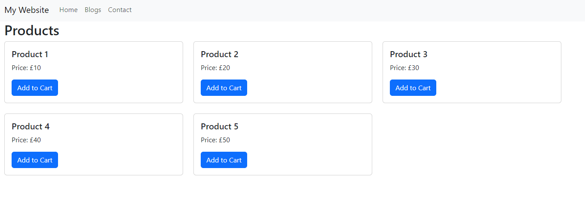

# Props

In React, props (short for "*properties*") are a fundamental concept used for passing data from one component to another. Props allow you to customize and configure components dynamically by providing them with data as attributes.

React also provides a default props object that contains certain predefined properties and methods.

Let's update our Home.jsx.

## A note about HMR

HMR stands for Hot Module Replacement. It's a feature commonly found in modern build tools and development servers, including Webpack and Vite, that enables developers to see changes to their code reflected instantly in the browser without requiring a full page reload.

So what does this mean for you? Well, it means that if your site is up and running, you can change your code and save the file and it will be instantly updated rather than you having to stop and start the server! Nice.

Try it by replacing the code in `Home.jsx` with that below when your site is running.

## Home.jsx

```jsx
const Home = (props) => {
  // Accessing props object
  // For example, we can access the "className" prop to customize the class of the <h1> element
  const { className } = props;

  return <h1 className={className}>Home</h1>;
};

// Default props
Home.defaultProps = {
  className: 'home-title', // Default class name for the <h1> element
};

export default Home;
```

Save the file and see it updated.

---

Let's do something more exciting. Let's add a series of bootstrap cards to represent products that we have got from the database. Of course, we don't have a database yet to connect to, so we'll be using a dummy array of objects.

At the top of `Home.jsx` add:

```
const products = [
  { id: 1, name: 'Product 1', price: 10 },
  { id: 2, name: 'Product 2', price: 20 },
  { id: 3, name: 'Product 3', price: 30 },
  { id: 4, name: 'Product 4', price: 40 },
  { id: 5, name: 'Product 5', price: 50 },
];
```

Next, we want to update our function call:

```jsx
const Home = () => {
    return (
      <>
        <h2>Products</h2>
        <div className="row">
          {products.map(product => (
            <div key={product.id} className="col-md-4 mb-4">
              <div className="card">
                <div className="card-body">
                  <h5 className="card-title">{product.name}</h5>
                  <p className="card-text">Price: £{product.price}</p>
                  <a href="#" className="btn btn-primary">Add to Cart</a>
                </div>
              </div>
            </div>
          ))}
        </div>
      </>
    );
  };
```

Inside the Home component, we `map` over the products array to render each product as a card within a Bootstrap grid `(row and col-md-4)`.

The `products.map()` function is a method commonly used in JavaScript to iterate over each element in an array and perform a transformation or operation on each element. In React the `map()` function is often used to dynamically render components or elements based on data from an array.

For each product, we render its `name`, `price`, and an "Add to Cart" button using Bootstrap's card components and styling classes.

If you save the file, you should see:



---

## Passing Props

Now we've said that you can pass props from one component to another. In our example, the Home component is responsible for both fetching the data and the presentation. Often we'd split these out, and make one the *container* for the *presentation component*.

Let's do that now. Create a new folder `src/components`, and add a new file `ProductList.jsx`. This is going to be what is responsible for rendering products to the screen, but is not responsible for getting the data.

### ProductsList.jsx

```jsx

import PropTypes from 'prop-types'

const ProductList = ({ products }) => {
  return (
    <>
      <h3>Our Products</h3>
      <div className="row">
        {products.map(product => (
          <div key={product.id} className="col-md-4 mb-3">
            <div className="card">
              
              <div className="card-body">
                <h5 className="card-title">{product.name}</h5>
                <p className="card-text">Price: £{product.price}</p>
                <a href="#" className="btn btn-primary">Add to Cart</a>
              </div>
            </div>
          </div>
        ))}
      </div>
    </>
  );
};

ProductList.propTypes = {
  products: PropTypes.arrayOf(
    PropTypes.shape({
      id: PropTypes.number.isRequired,
      name: PropTypes.string.isRequired,
      price: PropTypes.number.isRequired,
    })
  ).isRequired,
};


export default ProductList;
```

We've moved the presentation code (all our HTML) out into this component now, and will pass it array to display.

One subtle change is this line:

```jsx
const ProductList = ({ products }) => ...
```

We've previously only used and empty set of parenthesis there. Now we have added `products`. This is a parameter, just using arrow notation. So we have a function ProductList that requires one parameter argument to be passed to it.

This syntax is called *destructuring assignment* in JavaScript. It allows you to extract properties from objects and bind them to variables with the same name. In this case, it extracts the products property from the object passed as an argument to the ProductList component and assigns it to a variable named products.

You'll most often see code like this which does the same thing:

```jsx
const ProductList = (props) => {
  const products = props.products;
  // Rest of the component logic...
};
```

But using destructuring assignment makes the code more concise and readable. It's a common pattern in React functional components to destructure props in the function signature like this to access individual props directly within the component body.

### PropTypes

Some interesting things in here. We import `PropTypes` from the `prop-types` package.

We define PropTypes validation for the `products` prop using `ProductList.propTypes`. This is *type checking* in JavaScript. Amazing, we love it. Finally some sanity.

Sadly the type checking is only at compile time, but better than nothing...

The `products` prop is expected to be an array of objects, where each object has `id`, `name`, and `price` properties of specific types (`number` for `id`, `string` for `name`, and `number` for `price`).

Finally `.isRequired` ensures that the products prop is required and must be provided when using the ProductList component.

#### I don't want to do all that! I'm a JavaScript hacker!

Well, you can just turn off the validation that's keeping you safe:

```js
ProductList.propTypes = null;
```

## Home.jsx

Now we need to update our `Home.jsx` to use the ProductList component, and use hooks to pass th products to it to be displayed, mimicking an API call:

```jsx
import { useState, useEffect } from 'react';
import ProductList from '../components/ProductList'; // Import the presentational component

const Home = () => {
  // State to store products data
  const [products, setProducts] = useState([]);

  useEffect(() => {
      
      const initialProducts = [
        { id: 1, name: 'Product 1', price: 10 },
        { id: 2, name: 'Product 2', price: 20 },
        { id: 3, name: 'Product 3', price: 30 },
        { id: 4, name: 'Product 4', price: 40 },
        { id: 5, name: 'Product 5', price: 50 },
      ];

      setProducts(initialProducts); //assign to our empty array

  }, []);

  return (
    <>
      <h2>Welcome to our Online Store</h2>
      {/* Render the ProductList component and pass products as props */}
      <ProductList products={products} />
    </>
  );
};

export default Home;
```

Save all your files and you should now see your card displayed with the new updated style!

## Adding some custom CSS

Let's make the cards a bit more interesting.

in the `src/components` folder, add a new file called `ProductList.css` and put this code in it:

```css
.card {
    transition: all 0.3s;
}

.card:hover {
    transform: scale(1.03);
}
```

Save the file, and then add the following import to `ProductList.jsx`:

```jsx
import './ProductList.css'
```

Now when you hover over a card, it'll get fractionally bigger. Cool.

---

[React Bootstrap >>](chapter6.md)
