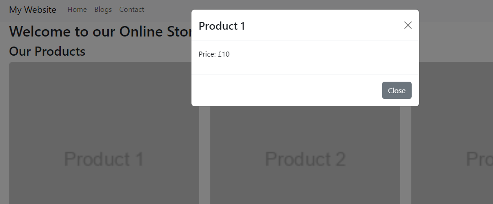

# React Bootstrap

Now you can get a long way just using Bootstrap. But we're using React, so there are advantages to using [react-bootstrap](https://react-bootstrap.netlify.app).

React-Bootstrap is a library that provides pre-built React components that are styled using Bootstrap. It allows you to use Bootstrap's CSS and JavaScript components within your React applications without the need for jQuery or additional JavaScript.

React-Bootstrap components are designed to integrate well with React's lifecycle methods, state management, and props. This makes them easier to use and maintain within React applications compared to manually integrating Bootstrap components with jQuery.

## Installation

Dead easy, just run:

`npm install react-bootstrap`

## Usage

Let's use our new components. We are going to use the [Modal](https://react-bootstrap.netlify.app/docs/components/modal) and [Button](https://react-bootstrap.netlify.app/docs/components/buttons) components to display a modal when a product card is clicked.

First, in our ProductList.jsx, we want to import a couple of things:

```jsx
import { useState } from 'react';
import { Modal, Button } from 'react-bootstrap';
```

Next, we want to handle a few things in our function:

```jsx
const ProductList = ({ products }) => {
  const [selectedProduct, setSelectedProduct] = useState(null);

  const handleShowModal = (product) => {
    setSelectedProduct(product);
  };

  const handleCloseModal = () => {
    setSelectedProduct(null);
  };

  //...rest of code

};
```

`const [selectedProduct, setSelectedProduct] = useState(null);`

This line initializes a state variable named `selectedProduct` using the `useState` hook. The initial state of `selectedProduct` is set to null. The useState hook returns an array with two elements: the current state value (`selectedProduct`) and a function to update that value (`setSelectedProduct`).

`const handleShowModal = (product) => { setSelectedProduct(product); };:` 
This function takes a `product` as a parameter. When called, it updates the `selectedProduct` state with the value of the `product` parameter. This function is  used to open the modal and display details for a specific product.

`const handleCloseModal = () => { setSelectedProduct(null); };: `
This parameterless function, when called, sets the `selectedProduct` state back to null, effectively closing the modal. 

Next, we need to update our return:

```jsx
return (
    <>
      <h3>Our Products</h3>
      <div className="row">
        {products.map(product => (
          <div key={product.id} className="col-md-4 mb-3">
            <div className="card" onClick={() => handleShowModal(product)}>
              
              <div className="card-body">
                <h5 className="card-title">{product.name}</h5>
                <p className="card-text">Price: £{product.price}</p>
                <a href="#" className="btn btn-primary">Add to Cart</a>
              </div>
            </div>
          </div>
        ))}
      </div>
      {/* Modal component */}
      {selectedProduct && (
        <Modal show={!!selectedProduct} onHide={handleCloseModal}>
          <Modal.Header closeButton>
            <Modal.Title>{selectedProduct.name}</Modal.Title>
          </Modal.Header>
          <Modal.Body>
            <p>Price: £{selectedProduct.price}</p>
            {/* Add more details here */}
          </Modal.Body>
          <Modal.Footer>
            <Button variant="secondary" onClick={handleCloseModal}>Close</Button>
          </Modal.Footer>
        </Modal>
      )}
    </>
  );
```

The main changes here are:

```js
<div className="card" onClick={() => handleShowModal(product)}>
```

We've added an `onClick` event to the card div, that will call the `handleShowModal` function, passing it the `product` as a parameter.

Next we've got our entire modal component:

```jsx
    {/* Modal component */}
      {selectedProduct && (
        <Modal show={!!selectedProduct} onHide={handleCloseModal}>
          <Modal.Header closeButton>
            <Modal.Title>{selectedProduct.name}</Modal.Title>
          </Modal.Header>
          <Modal.Body>
            <p>Price: £{selectedProduct.price}</p>
            {/* Add more details here */}
          </Modal.Body>
          <Modal.Footer>
            <Button variant="secondary" onClick={handleCloseModal}>Close</Button>
          </Modal.Footer>
        </Modal>
      )}
```

Let's break that down a bit...

```js
{selectedProduct && (...)}
```

This is a conditional rendering statement using a JavaScript logical AND operator (&&). If `selectedProduct` is truthy (i.e., not null, undefined, 0, false, or an empty string), the code inside the parentheses ((...)) will be rendered. This ensures that the modal is only rendered if a product is selected (`selectedProduct` is not null).

```js
<Modal ...>
```

This is the `Modal` component from React-Bootstrap, which displays a modal dialog. It takes several props, such as show, onHide, and others, to control its behaviour and appearance.

```js
show={!!selectedProduct}
```

This prop determines whether the modal is shown (true) or hidden (false). It is set to the boolean value of !!selectedProduct, ensuring that the modal is shown when selectedProduct is truthy and hidden when it is falsy.

```js
onHide={handleCloseModal}
```
This prop specifies a function to be called when the modal is closed. It's set to handleCloseModal, which closes the modal by setting selectedProduct back to null.

```js
<Modal.Title>{selectedProduct.name}</Modal.Title>
```
This component displays the name of the selected product as the modal title.

```js
<Button variant="secondary" onClick={handleCloseModal}>Close</Button>
```
This is a button component from React-Bootstrap. It's used to close the modal when clicked by calling the handleCloseModal function.

---

Save your changed code. When you now click on a card, it will display a modal:



## Challenges

1. Each Product should have its own component, so we can reuse it. Create a ProductCard component to use in ProductList.

    You'll be adding in more propTypes for the ProductCard. Instead of being an array of products, it's a single product passed in, so you will need to use:

    ```jsx
    ProductCard.propTypes = {
        product: 
        PropTypes.shape({
            id: PropTypes.number.isRequired,
            name: PropTypes.string.isRequired,
            price: PropTypes.number.isRequired,
        }).isRequired,
    };
    ```

2. The modal is displayed when you click on the button on the card too, so you cannot add it to the basket! Fix it!

3. Tricky! It seems we have duplicated code now - extract the modal into its own ProductModal component so it can be reused.

    You'll probably need to refactor an amount of code to do this. I ended up passing in three props. To add them to your propTypes you need to state the type, eg

    ```
    mysecondprop: PropTypes.bool.isRequired;
    myotherprop: PropType.func.isRequired;
    ```

    All PropTypes: https://www.npmjs.com/package/prop-types

---

What happens when we have stuff we might want to display, or not display? Next we look at [react conditionals >>](chapter7.md)