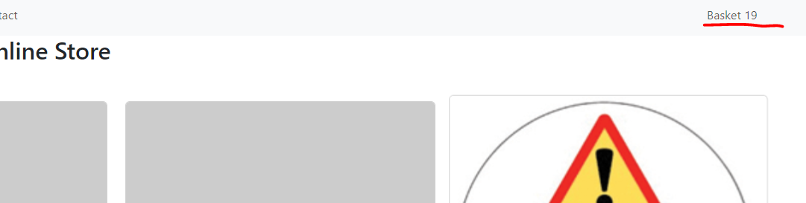
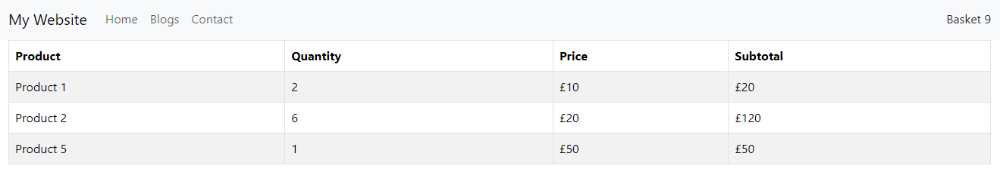

# React Context

## The Problem

State should be held by the highest parent component in the stack that requires access to the state.

The component at the top and bottom of the stack need access to the state.

To do this without Context, we will need to pass the state as "props" through each nested component. This is called "prop drilling", which is what we have just done passing the product down through the ProductList to the Product Card and then to the ProductModal.

## The Solution - Global State

React Context is a way to manage state globally.

It can be used together with the `useState` Hook to share state between deeply nested components more easily than with `useState` alone.

To create context, you must Import `createContext` and initialize it:

```js
import { useState, createContext } from "react";

const UserContext = createContext()
```

You can then do the normal things, like setting the state of a variable, and use the Context Provider to wrap the tree of components that need the state Context:

```js
function ParentComponent() {
  const [user, setUser] = useState("Jesse Hall");

  return (
    <UserContext.Provider value={user}>
      <h1>{`Hello ${user}!`}</h1>
      <ChildComponent1 user={user} />
    </UserContext.Provider>
  );
}
```

Now *all* the children will have access to the `userContext`. Let's say we had five nested components, but we only wanted the last child component to display the name again. We'd have to pass that prop through *all* the children!

Instead, using context, we can just gain access to the global state from anywhere we need it without having to pass it through all the layers:

```js
import { useState, createContext, useContext } from "react";

function ChildComponent5() {
  const user = useContext(UserContext);

  return (
    <>
      <h1>ChildComponent 5</h1>
      <h2>{`Hello ${user} again!`}</h2>
    </>
  );
}
```

There's a lot of code to write out for all the layers, but here's an online working example: https://playcode.io/1856315

---

Of course, that's a very simplified example. Let's write something a lot more complicated - the basket. We want our basket to be displayed on the nav bar, and tell the customer how many items they have in the basket. Later we'll add a basket route and page too.

## BasketContext

First up, we are going to create a new `BasketContext.jsx` file in `src/context`. Having a separate context file like this makes it more reusable. It's a simple file that uses `createContext` and exports the context.

```jsx
import { createContext } from 'react';

// Create and export the BasketContext
export const BasketContext = createContext();
```

Next, we want this to be available for our whole app, so we'll use in in `App.jsx`. First we import what we need:

```jsx
import { useState } from "react";
import { BasketContext } from "./context/BasketContext"; 
```

Then we want to set the `basket` variable to an empty array:

```jsx
const App = () => {

  // eslint-disable-next-line no-unused-vars
  const [basket, setBasket] = useState([]);

//.... rest of the code
}
```

Finally, we need to wrap our BrowserRouter with our `BasketContext.Provider`:

```jsx
const App = () => {

  // eslint-disable-next-line no-unused-vars
  const [basket, setBasket] = useState(0); //just using an int for now

  return (
    <BasketContext.Provider value={{ basket, setBasket }}>
      <BrowserRouter>
            //..code as before
      </BrowserRouter>
    </BasketContext.Provider>
  );
};
```

### eslint-disable-next-line no-unused-vars

Because we don't use `setBasket` in this component, we get errors unless we add this line above which tells the linter to ignore any errors on the next line about unused variables or functions.

## Adding To The Basket

Now we have the context set up, we need to be able to add things to the basket. That's in our ProductCard component.

First we need to import:

```jsx
import { useContext } from 'react';
import { BasketContext } from '../context/BasketContext';
```

Then we need to get the basket from our context:

```jsx
const ProductCard = ({ product }) => {
    const { basket, setBasket } = useContext(BasketContext);

    //...rest of the code

}
```

If you have not updated your card to use react-bootstrap already, you will need to import `{ Button }`.

```jsx
    {/* Use onClick handler for the button */}
    <Button variant="primary" onClick={addItemToBasket}>Add to Basket</Button>
```

And add the function:

```jsx
const addItemToBasket = (event) => {
    event.stopPropagation();
    const updatedBasket = basket + 1
    setBasket(updatedBasket);
}
```

This function isn't very complicated - it just adds the product id to the basket array so we can return the length (the number of items in the basket).

We want our basket displayed on our Nav bar so it's available on every page, so we need to update Layout.jsx:

```jsx
import { useContext } from 'react';
import { BasketContext } from '../context/BasketContext';

const Layout = () => {
  const { basket } = useContext(BasketContext);

  //...rest of code

}
```

And we need to update our nav links:

```jsx
<Nav className="me-auto">
    <Nav.Link as={Link} to="/">Home</Nav.Link>
    <Nav.Link as={Link} to="/blogs">Blogs</Nav.Link>
    <Nav.Link as={Link} to="/contact">Contact</Nav.Link>
</Nav>
{/* Basket option */}
<Nav>
    <Nav.Link as={Link} to="#">Basket {basket}</Nav.Link>
</Nav>
```

Since `basket` is just an int, we'll display 0 when we start.

Okay, save all that and run your site. When you click Add to Basket on a product you will see your basket increment:



---

## Extending our Basket

Of course, being able to update a counter is one thing, but we really want to be able to do is some way to track what a user has actually added to their basket. Whilst it's not ideal to keep this in global state, it's useful for our purposes to see how to pass props through context.

The first thing we are going to do is create aa basket page in `src/pages`, where we will be able to see the items in our basket.

### Basket.jsx
```jsx
import { useContext } from 'react';
import { Table } from 'react-bootstrap';
import { BasketContext } from '../context/BasketContext';

const Basket = () => {
    const { basket } = useContext(BasketContext);

  return (
      <>
          <div className="row">
              <div className="col-md-12">
                    {/*here is where we will add code later to show the basket*/}
              </div>
            </div>
    </>
  );
};

export default Basket;
```
### App.jsx

We need to import our new page:

```jsx
import Basket from "./pages/Basket";
```

And add the route:

```jsx
<Route path="basket" element={<Basket />} />
```

### Layout.jsx

We need to update our link:

```jsx
<Nav.Link as={Link} to="/basket">Basket {basket}</Nav.Link>
```

### The Basket

Now for a more subtle update, in our App.jsx file, we want to update the line:

```jsx
  // eslint-disable-next-line no-unused-vars
  const [basket, setBasket] = useState(0);
```

to store an array rather than an integer:

```jsx
  // eslint-disable-next-line no-unused-vars
  const [basket, setBasket] = useState([]);
```
Now, we are storing an array of products in our state, and we start with one that is empty.

Now that we are using an array of objects, our code is all horribly broken, and the number of items in the basket doesn't display.

### Design Decisions

Our product object looks like this:

```js
{ id: 1, name: 'Product 1', price: 10, stock_count: 5 },
```

Which is what we want to store in our basket. Now I *could* store just a list of these in the array and use `.length` to get the number of products in the basket. But if I do that, then wen I list them out rather than having an product with a quantity, I'll have the same product listed multiple times.

> I could write some code to group products together by their `id` on that page, but I'm not going to!

Instead I make the design decision that `basket` items will have a `quantity` property on their object. Because the `id` is unique, and the data is related, this makes sense to use a dictionary as when I add a product to the basket, I can find it by the  key and update the value quantity.

### ProductCard.jsx

I need to update my `addItemToBasket` function to add a new object to the basket:

```jsx
const addItemToBasket = (event) => {
    event.stopPropagation();
    const updatedBasket = {
            ...basket,
            [product.id]: { ...product, quantity: 1 }
    };
    setBasket(updatedBasket);
}
```

> The spread operator `(...)` is used in the provided code to create a new object or array by copying the properties or elements of an existing object or array.

`...basket` is used to copy all the properties of the `basket` object into a new object. It ensures that the new `updatedBasket` object includes all the existing items in the basket without modifying the original basket.

`[product.id]: { ...product, quantity: 1 } ` It uses the id of the `product` as the key for the new property being added to the `updatedBasket`. The spread operator `{ ...product, quantity: 1 }` is used to copy all the properties of the product object into the new object, and then add a new property `quantity` with the value `1`.

So far this works, but it will only ever set the quantity to 1, no matter how many times I click the button. This is because keys are unique, so we need to check if it exists, and if so, increment the quantity property rather than setting it. Let's update our function:

```jsx
const addItemToBasket = (event) => {
        event.stopPropagation();

        //Check if the product already exists in the basket
        if (basket[product.id]) {
            // If it exists, increase the quantity by 1
            const updatedBasket = {
            ...basket,
            [product.id]: {
                ...basket[product.id],
                quantity: basket[product.id].quantity + 1
            }
            };
            setBasket(updatedBasket);
        } else {
            // If it doesn't exist, add it to the basket with a quantity of 1
            const updatedBasket = {
            ...basket,
            [product.id]: { ...product, quantity: 1 }
            };
            setBasket(updatedBasket);
        }
    };
```

So now our `basket` in the context is an array of key-value pairs, with a key of product id and an object as the value. Now we'll need to update our code to display the sum of the quantity properties. Looking at Layout.jsx this will make it hard to refactor later if I put the code in there.

Time to build another component - BasketLink.jsx.

### BasketLink.jsx

in `src/components` create a new file `BasketLink.jsx`:

```jsx
import { useContext } from 'react';
import { Nav } from 'react-bootstrap';
import { BasketContext } from '../context/BasketContext';
import { Link } from 'react-router-dom';

const BasketLink = () => {
  const { basket } = useContext(BasketContext);
  
  let totalQuantity = 0;
  for (const item of Object.values(basket)) {
    totalQuantity += item.quantity;
  }
    
  return (
    <Nav.Link as={Link} to="/basket">
      Basket {totalQuantity}
    </Nav.Link>
  );
};

export default BasketLink;
```

We've got some new code we haven't seen before, namely:

```jsx
for (const item of Object.values(basket)) {
    totalQuantity += item.quantity;
  }
```

What's `Object.values(basket)` and what does it do?

`Object.values(basket)` returns an *array* containing all the values (objects) stored in the basket *dictionary*. The loop then iterates over each item object, allowing you to access and process them individually.

Excellent, so it's a way of iterating over all the values in the basket, which are objects we can then access.

### Layout.jsx

Finally we update our Layout.jsx file. First we import:

```jsx
import BasketLink from '../components/BasketLink';
```

And then we update our basket link:

```jsx
    //code as before
    </Nav>
    {/* Basket option */}
        <BasketLink/>
</Navbar.Collapse>
//code as before
```

### Basket.jsx

Finally, we can get back to our basket page, and display the items in our basket. Import `{ Tables }` from react-bootstrap and update the return to display a table:

```jsx

return (
      <>
          <div className="row">
              <div className="col-md-12">
                <Table striped bordered hover>
                    <thead>
                        <tr>
                        <th>Product</th>
                        <th>Quantity</th>
                        <th>Price</th>
                        <th>Subtotal</th>
                        </tr>
                    </thead>
                    <tbody>
                        {Object.values(basket).map(item => (
                        <tr key={item.id}>
                            <td>{item.name}</td>
                            <td>{item.quantity}</td>
                            <td>£{item.price}</td>
                            <td>£{item.quantity * item.price}</td>
                        </tr>
                        ))}
                    </tbody>
                </Table>
              </div>
            </div>
    </>
  );

```

Now when we run our code and add items to our basket, our basket total updates and when we click on our nav link we can see our basket items:



---

## Tasks

1. We don't have a basket total. Make a function to total the basket and display it underneath the table.

2. We can do better than a nav link that's text. Using [bootstrap icons](https://www.npmjs.com/package/react-bootstrap-icons) restyle the link to be an icon with a badge.

3. Our basket doesn't persist across page refreshes! What ways can you think of to persist the basket if the page refreshes?
